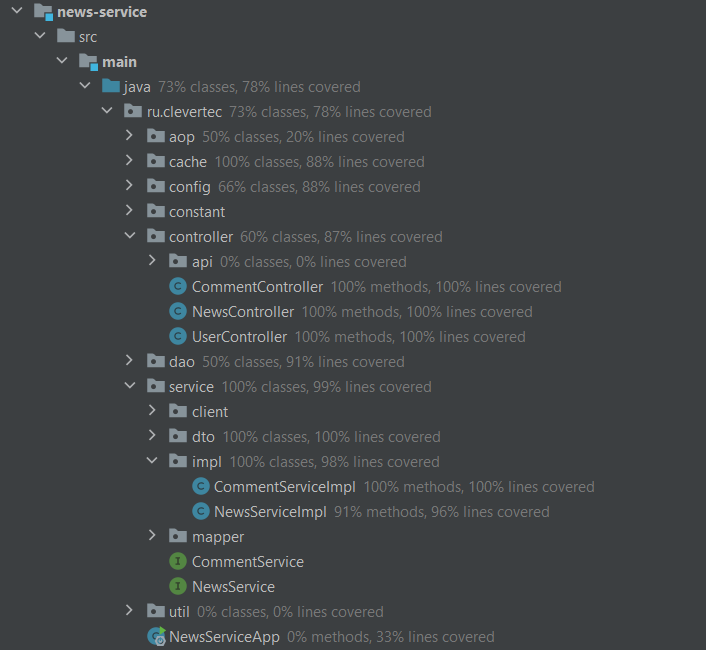

<a name="top-of-page"><h2>СИСТЕМА УПРАВЛЕНИЯ НОВОСТЯМИ</h2></a>

(CLEVERTEC COURSES TASK)

- [Параметры приложения, библиотеки и зависимости](#parameters-libraries)
- [Микросервисы и стартеры](#microservices-starters)
- [Конфигурационные файлы](#config-files)
- [Локальные порты](#ports)
- [Запуск и работа с приложением](#application-run)
- [База данных](#database)
- [Кэширование](#cache)
- [Логирование](#logging)
- [Примеры работы с SpringDoc OpenAPI](#open-api)
    - [Users Controller](#users-controller)
    - [News Controller](#news-controller)
    - [Comments Controller](#comments-controller)
- [Покрытие тестами](#tests)

***

<a name="parameters-libraries"><h2>Параметры приложения, библиотеки и зависимости</h2></a>

- Java 17
- Gradle 8.0
- Spring Boot 3.2.1
- SpringFramework Cloud 4.1.0
- SpringDoc OpenAPI 2.3.0
- Java JWT 4.4.0
- PostgreSQL 15.2 (*)
- PostgreSQL JDBC Driver 42.7.1
- Redis 7.2 (*)
- Liquibase 4.25.0
- MapStruct 1.5.5.Final
- Lombok Plugin 6.5.1
- Testcontainers 1.19.3
- WireMock 3.3.1

(*) Docker-контейнеры.

Предусмотрено два профиля для работы с приложением: **dev** и **prod**
(см. [Запуск и работа с приложением](#application-run)).

```
! Может потребоваться настройка среды разработки под актуальные версии - Java 17, Gradle 8.0.

! Для работы требуется Docker.
```

[к началу](#top-of-page)

***

<a name="microservices-starters"><h2>Микросервисы и стартеры</h2></a>

Приложение состоит из следующих микросервисов и spring-стартеров:

- **news-service** - микросервис, предоставляющий функционал для работы с новостями (News) и комментариями (Comment).
- **user-service** - микросервис, предоставляющий функционал регистрации и авторизации пользователей (User).
- **logging-starter** (*) - spring-стартер, предназначенный для логирования (см. [Логирование](#logging)).
- **exception-handler-starter** (*) - spring-стартер, предназначенный для обработки исключений.

(*) При сборке проекта публикуются в maven local.

[к началу](#top-of-page)

***

<a name="config-files"><h2>Конфигурационные файлы</h2></a>

Конфигурационные файлы приложения:

- **news-service** - [application.yml](news-service/src/main/resources/application.yml "application.yml"),
  [application-dev.yml](news-service/src/main/resources/application-dev.yml "application-dev.yml"),
  [application-prod.yml](news-service/src/main/resources/application-prod.yml "application-prod.yml"),
  [application-test.yml](news-service/src/test/resources/application-test.yml "application-test.yml").
- **user-service** - [application.yml](user-service/src/main/resources/application.yml "application.yml"),
  [application-dev.yml](user-service/src/main/resources/application-dev.yml "application-dev.yml"),
  [application-prod.yml](user-service/src/main/resources/application-prod.yml "application-prod.yml").
- **logging-starter** - [logback.xml](logging-starter/src/main/resources/logback.xml "logback.xml").

[к началу](#top-of-page)

***

<a name="ports"><h2>Локальные порты</h2></a>

Для работы приложения требуются следующие локальные порты:

- **5432** - порт зарезервирован под базу данных.
- **8080** - порт зарезервирован под микросервис news-service.
- **8081** - порт зарезервирован под микросервис user-service.
- **6379** - порт зарезервирован под Redis (для реализации кэширования).

[к началу](#top-of-page)

***

<a name="application-run"><h2>Запуск и работа с приложением</h2></a>

Для работы с приложением необходимо использовать Docker, для чего предусмотрен
[docker-compose.yml](docker-compose.yml "docker-compose.yml").

Очередность выполнения операций при запуске приложения:

1. **docker compose up db-news-management**
2. **gradle build**
3. **docker compose up**

Описание операций:

1. Создание docker-контейнера для базы данных.
2. Сборка проекта. Выполняется только после первого пункта,
   так как для интеграционных тестов требуется наличие docker-контейнера базы данных.
3. Создание docker-контейнеров для микросервисов news-service, user-service.
   Создание docker-контейнера redis-cache для осуществления кэширования данных
   (см. [Кэширование](#cache)).

После выполнения всех операций для работы с использованием средств SpringDoc OpenAPI
требуется перейти в браузере по адресу:</br>
http://localhost:8080/swagger-ui/index.html

(см. [Примеры работы с SpringDoc OpenAPI](#open-api))

```
! Отдельный запуск Main-классов не требуется.
```

В приложении реализованы следующие уровни доступа (зависят от прав авторизованного пользователя):

- **ADMIN** - доступны все операции.
- **JOURNALIST** - доступны операции по чтению, созданию, редактированию, удалению новостей и комментариев.
- **SUBSCRIBER** - доступны операции по чтению, созданию, редактированию, удалению комментариев.
- Неавторизованным пользователям доступны только операции чтения.

Профили **dev** и **prod** можно изменить в конфигурационных файлах:

- news-service - [application.yml](news-service/src/main/resources/application.yml "application.yml")
- user-service - [application.yml](user-service/src/main/resources/application.yml "application.yml")

Docker-контейнеры:

- **db-news-management**
- **news-service**
- **user-service**
- **redis-cache**

[к началу](#top-of-page)

***

<a name="database"><h2>База данных</h2></a>

База данных заполняется автоматически (при помощи Liquibase).

Схема базы данных:


см. [News](news-service/src/main/java/ru/clevertec/dao/entity/News.java "News.java"),
[Comment](news-service/src/main/java/ru/clevertec/dao/entity/Comment.java "Comment.java"),
[User](user-service/src/main/java/ru/clevertec/dao/entity/User.java "User.java"),
[Role](user-service/src/main/java/ru/clevertec/dao/entity/Role.java "Role.java")

[к началу](#top-of-page)

***

<a name="cache"><h2>Кэширование</h2></a>

В приложении предусмотрены различные алгоритмы кэширования для разных профилей (для микросервиса news-service):

- профиль **dev** - реализованы кастомные
  [LRU](news-service/src/main/java/ru/clevertec/cache/impl/LRUCache.java "LRUCache.java") и
  [LFU](news-service/src/main/java/ru/clevertec/cache/impl/LFUCache.java "LFUCache.java") алгоритмы кэширования данных.</br>
  Изменить алгоритм кэширования с LRU на LFU (и обратно) можно в конфигурационном файле
  [application-dev.yml](news-service/src/main/resources/application-dev.yml "application-dev.yml").</br>
  Кэширование осуществляется средствами АОП
  (см. [NewsRepositoryAspect](news-service/src/main/java/ru/clevertec/aop/NewsRepositoryAspect.java "NewsRepositoryAspect.java"),
  [CommentRepositoryAspect](news-service/src/main/java/ru/clevertec/aop/CommentRepositoryAspect.java "CommentRepositoryAspect.java")).
- профиль **prod** - кэширование осуществляется средствами SpringFramework Cache и Redis.

[к началу](#top-of-page)

***

<a name="logging"><h2>Логирование</h2></a>

Логирование в приложении реализовано через logging-starter (см. [Микросервисы и стартеры](#microservices-starters)).

Файлы, содержащие сформированные логи, сохраняются в папку **logs** в корневой директории проекта.

Конфигурационный файл для настройки логирования:
[logback.xml](logging-starter/src/main/resources/logback.xml "logback.xml").

[к началу](#top-of-page)

***

<a name="open-api"><h2>Примеры работы с SpringDoc OpenAPI</h2></a>

Для работы с приложением с использованием средств SpringDoc OpenAPI
требуется перейти в браузере по адресу:</br>
http://localhost:8080/swagger-ui/index.html

(см. [Запуск и работа с приложением](#application-run))

[к началу](#top-of-page)

<a name="users-controller"><h2>Users Controller</h2></a>

Контроллер для работы с регистрацией и авторизацией пользователей
(см. [UserController](news-service/src/main/java/ru/clevertec/controller/UserController.java "UserController.java")).

### Регистрация нового пользователя

<table>
<thead>
<tr><th colspan=2 align=left>POST - /api/v1/users/registration</th></tr>
<tr><th align=left>Request</th><th align=left>Response</th></tr>
</thead>
<tbody>
<tr>
<td align=left>
Request Body:
<pre>
{
  "username": "Username",
  "password": "qwerty",
  "email": "email@gmail.com",
  "role": "ADMIN"
}
</pre>
</td>
<td align=left>
<pre>
{
  "token": "Some JWT Token"
}
</pre>
</td>
</tr>
</tbody>
</table>

### Авторизация пользователя

<table>
<thead>
<tr><th colspan=2 align=left>POST - /api/v1/users/authentication</th></tr>
<tr><th align=left>Request</th><th align=left>Response</th></tr>
</thead>
<tbody>
<tr>
<td align=left>
Request Body:
<pre>
{
  "username": "Admin",
  "password": "qwerty"
}
</pre>
</td>
<td align=left>
<pre>
{
  "token": "Some JWT Token"
}
</pre>
</td>
</tr>
</tbody>
</table>

[к началу](#top-of-page)

<a name="news-controller"><h2>News Controller</h2></a>

Контроллер для работы с новостями
(см. [NewsController](news-service/src/main/java/ru/clevertec/controller/NewsController.java "NewsController.java")).

### Получение новости по UUID

<table>
<thead>
<tr><th colspan=2 align=left>GET - /api/v1/news/{uuid}</th></tr>
<tr><th align=left>Request</th><th align=left>Response</th></tr>
</thead>
<tbody>
<tr>
<td align=left>
Parameters:
<pre>
News UUID:
77fcd1b2-568a-441c-92ec-0253338cd5aa
</pre>
</td>
<td align=left>
<pre>
{
  "uuid": "77fcd1b2-568a-441c-92ec-0253338cd5aa",
  "title": "Some News Title",
  "text": "Some News Text",
  "author": "Some Author Name",
  "createDate": "2024-02-15T09:30:00:000",
  "updateDate": "2024-02-15T09:30:00:000"
}
</pre>
</td>
</tr>
</tbody>
</table>

### Получение новости по UUID с комментариями

<table>
<thead>
<tr><th colspan=2 align=left>GET - /api/v1/news/{uuid}/comment</th></tr>
<tr><th align=left>Request</th><th align=left>Response</th></tr>
</thead>
<tbody>
<tr>
<td align=left>
Parameters:
<pre>
News UUID:
77fcd1b2-568a-441c-92ec-0253338cd5aa
</pre>
</td>
<td align=left>
<pre>
{
  "uuid": "77fcd1b2-568a-441c-92ec-0253338cd5aa",
  "title": "Some News Title",
  "text": "Some News Text",
  "author": "Some Author Name",
  "createDate": "2024-02-15T09:30:00:000",
  "updateDate": "2024-02-15T09:30:00:000",
  "comments": []
}
</pre>
</td>
</tr>
</tbody>
</table>

### Получение всех новостей (с пагинацией)

<table>
<thead>
<tr><th colspan=2 align=left>GET - /api/v1/news</th></tr>
<tr><th align=left>Request</th><th align=left>Response</th></tr>
</thead>
<tbody>
<tr>
<td align=left>
Parameters:
<pre>
Page Number:
0

Page Max Size:
10
</pre>
</td>
<td align=left>
<pre>
{
  "content": [
    {
      "uuid": "77fcd1b2-568a-441c-92ec-0253338cd5aa",
      "title": "Some News Title",
      "text": "Some News Text",
      "createDate": "2024-02-15T09:30:00:000",
      "updateDate": "2024-02-15T09:30:00:000"
    }
  ],
  "pageable": {
    "pageNumber": 0,
    "pageSize": 10
  }
}
</pre>
</td>
</tr>
</tbody>
</table>

### Получение всех новостей по искомому тексту (с пагинацией)

<table>
<thead>
<tr><th colspan=2 align=left>GET - /api/v1/news/searchbytext</th></tr>
<tr><th align=left>Request</th><th align=left>Response</th></tr>
</thead>
<tbody>
<tr>
<td align=left>
Parameters:
<pre>
Page Number:
0

Page Max Size:
10

Text For Search:
News
</pre>
</td>
<td align=left>
<pre>
{
  "content": [
    {
      "uuid": "77fcd1b2-568a-441c-92ec-0253338cd5aa",
      "title": "Some News Title",
      "text": "Some News Text",
      "createDate": "2024-02-15T09:30:00:000",
      "updateDate": "2024-02-15T09:30:00:000"
    }
  ],
  "pageable": {
    "pageNumber": 0,
    "pageSize": 10
  }
}
</pre>
</td>
</tr>
</tbody>
</table>

### Создание новой новости (только для прав доступа ADMIN, JOURNALIST)

<table>
<thead>
<tr><th colspan=2 align=left>POST - /api/v1/news</th></tr>
<tr><th align=left>Request</th><th align=left>Response</th></tr>
</thead>
<tbody>
<tr>
<td align=left>
Request Body:
<pre>
{
  "title": "News Title",
  "text": "News Text"
}
</pre>
</td>
<td align=left>
<pre>
{
  "uuid": "77fcd1b2-568a-441c-92ec-0253338cd5aa",
  "title": "News Title",
  "text": "News Text",
  "author": "Author Name",
  "createDate": "2024-02-15T09:30:00:000",
  "updateDate": "2024-02-15T09:30:00:000"
}
</pre>
</td>
</tr>
</tbody>
</table>

### Обновление существующей новости (только для прав доступа ADMIN, JOURNALIST)

<table>
<thead>
<tr><th colspan=2 align=left>PUT - /api/v1/news/{uuid}</th></tr>
<tr><th align=left>Request</th><th align=left>Response</th></tr>
</thead>
<tbody>
<tr>
<td align=left>
Parameters:
<pre>
News UUID:
77fcd1b2-568a-441c-92ec-0253338cd5aa
</pre>
Request Body:
<pre>
{
  "title": "News Title",
  "text": "News Text"
}
</pre>
</td>
<td align=left>
<pre>
{
  "uuid": "77fcd1b2-568a-441c-92ec-0253338cd5aa",
  "title": "News Title",
  "text": "News Text",
  "author": "Author Name",
  "createDate": "2024-02-15T09:30:00:000",
  "updateDate": "2024-02-15T09:40:00:000"
}
</pre>
</td>
</tr>
</tbody>
</table>

### Удаление новости по UUID (только для прав доступа ADMIN, JOURNALIST)

<table>
<thead>
<tr><th colspan=2 align=left>DELETE - /api/v1/news/{uuid}</th></tr>
<tr><th align=left>Request</th></tr>
</thead>
<tbody>
<tr>
<td align=left>
Parameters:
<pre>
News UUID:
77fcd1b2-568a-441c-92ec-0253338cd5aa
</pre>
</tr>
</tbody>
</table>

[к началу](#top-of-page)

<a name="comments-controller"><h2>Comments Controller</h2></a>

Контроллер для работы с комментариями
(см. [CommentController](news-service/src/main/java/ru/clevertec/controller/CommentController.java "CommentController.java")).

### Получение комментария по UUID

<table>
<thead>
<tr><th colspan=2 align=left>GET - /api/v1/comments/{uuid}</th></tr>
<tr><th align=left>Request</th><th align=left>Response</th></tr>
</thead>
<tbody>
<tr>
<td align=left>
Parameters:
<pre>
Comment UUID:
b655f85d-4838-40ca-a853-e93760babd29
</pre>
</td>
<td align=left>
<pre>
{
  "uuid": "b655f85d-4838-40ca-a853-e93760babd29",
  "text": "Some Comment Text",
  "username": "Some Username",
  "createDate": "2024-02-15T09:31:00:000",
  "updateDate": "2024-02-15T09:31:00:000",
  "newsUuid": "77fcd1b2-568a-441c-92ec-0253338cd5aa"
}
</pre>
</td>
</tr>
</tbody>
</table>

### Получение всех комментариев (с пагинацией)

<table>
<thead>
<tr><th colspan=2 align=left>GET - /api/v1/comments</th></tr>
<tr><th align=left>Request</th><th align=left>Response</th></tr>
</thead>
<tbody>
<tr>
<td align=left>
Parameters:
<pre>
Page Number:
0

Page Max Size:
10
</pre>
</td>
<td align=left>
<pre>
{
  "content": [
    {
      "uuid": "b655f85d-4838-40ca-a853-e93760babd29",
      "text": "Some Comment Text",
      "username": "Some Username",
      "createDate": "2024-02-15T09:31:00:000",
      "updateDate": "2024-02-15T09:31:00:000"
    }
  ],
  "pageable": {
    "pageNumber": 0,
    "pageSize": 10
  }
}
</pre>
</td>
</tr>
</tbody>
</table>

### Получение всех комментариев по UUID новости (с пагинацией)

<table>
<thead>
<tr><th colspan=2 align=left>GET - /api/v1/comments/bynews</th></tr>
<tr><th align=left>Request</th><th align=left>Response</th></tr>
</thead>
<tbody>
<tr>
<td align=left>
Parameters:
<pre>
Page Number:
0

Page Max Size:
10

News UUID:
77fcd1b2-568a-441c-92ec-0253338cd5aa
</pre>
</td>
<td align=left>
<pre>
{
  "content": [
    {
      "uuid": "b655f85d-4838-40ca-a853-e93760babd29",
      "text": "Some Comment Text",
      "username": "Some Username",
      "createDate": "2024-02-15T09:31:00:000",
      "updateDate": "2024-02-15T09:31:00:000"
    }
  ],
  "pageable": {
    "pageNumber": 0,
    "pageSize": 10
  }
}
</pre>
</td>
</tr>
</tbody>
</table>

### Создание нового комментария (только для прав доступа ADMIN, JOURNALIST, SUBSCRIBER)

<table>
<thead>
<tr><th colspan=2 align=left>POST - /api/v1/comments</th></tr>
<tr><th align=left>Request</th><th align=left>Response</th></tr>
</thead>
<tbody>
<tr>
<td align=left>
Request Body:
<pre>
{
  "text": "Comment Text",
  "newsUuid": "77fcd1b2-568a-441c-92ec-0253338cd5aa"
}
</pre>
</td>
<td align=left>
<pre>
{
  "uuid": "b655f85d-4838-40ca-a853-e93760babd29",
  "text": "Comment Text",
  "username": "Username",
  "createDate": "2024-02-15T09:31:00:000",
  "updateDate": "2024-02-15T09:31:00:000",
  "newsUuid": "77fcd1b2-568a-441c-92ec-0253338cd5aa"
}
</pre>
</td>
</tr>
</tbody>
</table>

### Обновление существующего комментария (только для прав доступа ADMIN, JOURNALIST, SUBSCRIBER)

<table>
<thead>
<tr><th colspan=2 align=left>PUT - /api/v1/comments/{uuid}</th></tr>
<tr><th align=left>Request</th><th align=left>Response</th></tr>
</thead>
<tbody>
<tr>
<td align=left>
Parameters:
<pre>
Comment UUID:
b655f85d-4838-40ca-a853-e93760babd29
</pre>
Request Body:
<pre>
{
  "text": "Comment Text",
  "newsUuid": "77fcd1b2-568a-441c-92ec-0253338cd5aa"
}
</pre>
</td>
<td align=left>
<pre>
{
  "uuid": "b655f85d-4838-40ca-a853-e93760babd29",
  "text": "Comment Text",
  "username": "Username",
  "createDate": "2024-02-15T09:31:00:000",
  "updateDate": "2024-02-15T09:35:00:000",
  "newsUuid": "77fcd1b2-568a-441c-92ec-0253338cd5aa"
}
</pre>
</td>
</tr>
</tbody>
</table>

### Удаление комментария по UUID (только для прав доступа ADMIN, JOURNALIST, SUBSCRIBER)

<table>
<thead>
<tr><th colspan=2 align=left>DELETE - /api/v1/comments/{uuid}</th></tr>
<tr><th align=left>Request</th></tr>
</thead>
<tbody>
<tr>
<td align=left>
Parameters:
<pre>
Comment UUID:
b655f85d-4838-40ca-a853-e93760babd29
</pre>
</tr>
</tbody>
</table>

[к началу](#top-of-page)

***

<a name="tests"><h2>Покрытие тестами</h2></a>

Покрытие тестами news-service:



Покрытие тестами user-service:


[к началу](#top-of-page)

***